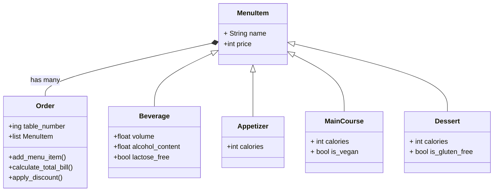

# reto3


 # Punto 1
 Points, Lines and Rectangles
```python
from math import sqrt
class Point:
    def __init__ (self,x,y):
        self.x=x
        self.y=y
        
class Line:
    def __init__(self,start:Point,end:Point):
        self.start=start
        self.end=end
        self.distance_x=self.end.x-self.start.x
        self.distance_y=self.end.y-self.start.y
    def compute_slope(self):
        slope=self.distance_y/self.distance_x
        return slope
    def compute_length(self):
        return sqrt(self.distance_x**2+self.distance_y**2)
    def compute_horizontal_cross(self):
        if(self.start.y*self.end.y<=0):
            return True
        else:
            return False
    def compute_vertical_cross(self):
        if(self.start.x*self.end.x<=0):
            return True
        else:
            return False    
line1=Line(Point(2,2),Point(3,3))
line2=Line(Point(-2,-3),Point(2,3))
print(line1.compute_slope())
print(line1.compute_length())
print(line1.compute_horizontal_cross())
print(line1.compute_vertical_cross())
print(line2.compute_horizontal_cross())
print(line2.compute_vertical_cross())


class Rectangle:
    def __init__(self,method,*args):
        #bottom left corner (point) width height
        if method==1:
            self.bottom_left=args[0]
            self.width=args[1]
            self.height=args[2]
            self.top_right=Point(self.bottom_left.x+self.width,self.bottom_left.y+self.height)
        #center point width height
        elif method==2:
            self.center=args[0]
            self.width=args[1]
            self.height=args[2]
            self.bottom_left=Point(self.center.x-self.width/2,self.center.y-self.height/2)
            self.top_right=Point(self.center.x+self.width/2,self.center.y+self.height/2)
        #two opposite points
        elif method==3:
            self.bottom_left=args[0]
            self.top_right=args[1]
            self.width=self.top_right.x-self.bottom_left.x
            self.height=self.top_right.y-self.bottom_left.y
        # 4 lines
        elif method==4:
            self.bottom=args[0]
            self.top=args[1]
            self.left=args[2]
            self.right=args[3]
            self.width=self.right.compute_length()
            self.height=self.top.compute_length()
            self.bottom_left=self.bottom.start
            self.top_right=self.top.end
    def compute_area(self):
        return self.width*self.height
    def compute_perimeter(self):
        return 2*(self.width+self.height)
rectangle1=Rectangle(1,Point(2,2),3,4)
rectangle2=Rectangle(2,Point(2,2),3,4)
rectangle3=Rectangle(3,Point(2,2),Point(5,6))
rectangle4=Rectangle(4,Line(Point(2,2),Point(5,2)),Line(Point(5,2),Point(5,6)),Line(Point(5,6),Point(2,6)),Line(Point(2,6),Point(2,2)))
print(rectangle1.compute_area())
print(rectangle1.compute_perimeter())
print(rectangle2.compute_area())
print(rectangle2.compute_perimeter())
print(rectangle3.compute_area())
print(rectangle3.compute_perimeter())
print(rectangle4.compute_area())
print(rectangle4.compute_perimeter())

```

#Punto 2
Restaurant Items and orders
```python
class MenuItem:
    def __init__(self,name,price):
        self.name=name
        self.price=price
class Beverage(MenuItem):
    def __init__(self,name,price,volume,alcohol_content,lactose_free):
        super().__init__(name,price)
        self.volume=volume
        self.alcohol_content=alcohol_content
        self.lactose_free=lactose_free
class Appetizer(MenuItem):
    def __init__(self,name,price,calories):
        super().__init__(name,price)
        self.calories=calories

class MainCourse(MenuItem):
    def __init__(self,name,price,calories,is_vegan):
        super().__init__(name,price)
        self.calories=calories
        self.is_vegan=is_vegan
class Dessert(MenuItem):
    def __init__(self,name,price,calories,is_gluten_free):
        super().__init__(name,price)
        self.calories=calories
        self.is_gluten_free=is_gluten_free
class Order:
    def __init__(self,table_number):
        self.table_number=table_number
        self.menu_items=[]
    def add_menu_item(self,menu_item):
        self.menu_items.append(menu_item)
    def calculate_total_bill(self):
        total=0
        for item in self.menu_items:
            total+=item.price
        return total
    def apply_discount(self,discount):
        #based on the person
        if "senior" in discount:
            return self.calculate_total_bill()*0.9
        if "student" in discount:
            return self.calculate_total_bill()*0.8
        if "birthday" in discount:
            return self.calculate_total_bill()*0.7
        #based on the order composition
        if "beverage" in discount:
            for item in self.menu_items:
                if isinstance(item,Beverage):
                    return self.calculate_total_bill()*0.9
        if "combo" in discount:
            for item in self.menu_items:
                if isinstance(item,MainCourse) and isinstance(item,Appetizer) and isinstance(item,Dessert):
                    return self.calculate_total_bill()*0.8
        if "huge" in discount:
            if len(self.menu_items)>=4:
                return self.calculate_total_bill()*0.85

#items all prices are in dollars
roasted_chicken=MainCourse("Roasted Chicken",15,500,False)
chicken_wings=Appetizer("Chicken Wings",10,300)
chocolate_cake=Dessert("Chocolate Cake",5,400,True)
beer=Beverage("Beer",5,0.5,0.05,False)
salmon=MainCourse("Salmon",20,600,False)
fries=Appetizer("Fries",5,200)
ice_cream=Dessert("Ice Cream",4,300,True)
wine=Beverage("Wine",8,0.75,0.12,False)
lemonade=Beverage("Lemonade",3,0.3,0,False)
lentil_soup=Appetizer("Lentil Soup",6,250)
apple_pie=Dessert("Apple Pie",5,350,True)
water_with_ice=Beverage("Water with Ice",0,0.5,0,False)
pork_cheeks=MainCourse("Pork Cheeks",18,550,False)
orange_chiken=MainCourse("Orange Chicken",16,500,False)
vegan_hamburguer=MainCourse(" Vegan Hamburguer",14,450,True)
#orders
order1=Order(1)
order1.add_menu_item(roasted_chicken)
order1.add_menu_item(chicken_wings)
order1.add_menu_item(chocolate_cake)
order1.add_menu_item(beer)
order2=Order(2)
order2.add_menu_item(salmon)
order2.add_menu_item(fries)
order2.add_menu_item(ice_cream)
order2.add_menu_item(wine)
order3=Order(3)
order3.add_menu_item(lemonade)
order3.add_menu_item(lentil_soup)
order3.add_menu_item(apple_pie)
order3.add_menu_item(water_with_ice)
order1.apply_discount("senior")
order2.apply_discount("combo")
order3.apply_discount("huge")
print("the discount is",order1.apply_discount("senior"))
print("your bill is",order1.calculate_total_bill())
print("the discount is",order2.apply_discount("combo"))
print("your bill is",order2.calculate_total_bill())
print("the discount is",order3.apply_discount("huge"))
print("your bill is",order3.calculate_total_bill())

```
 class diagram

                     


       
